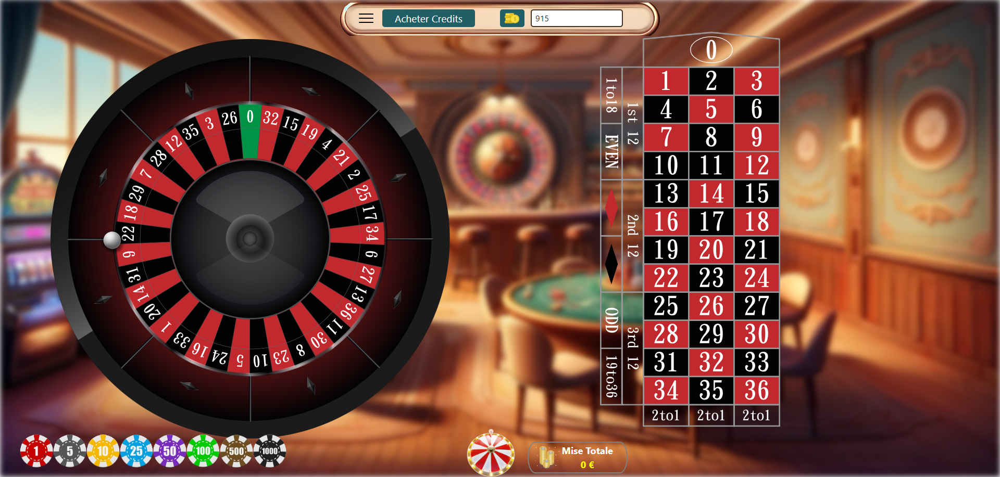
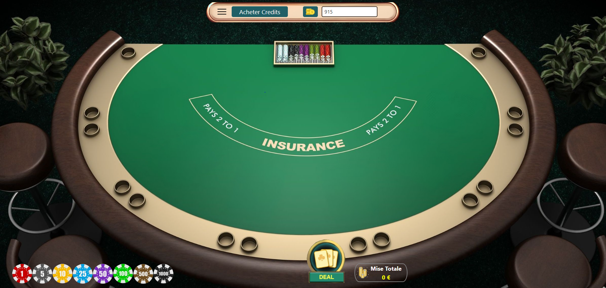
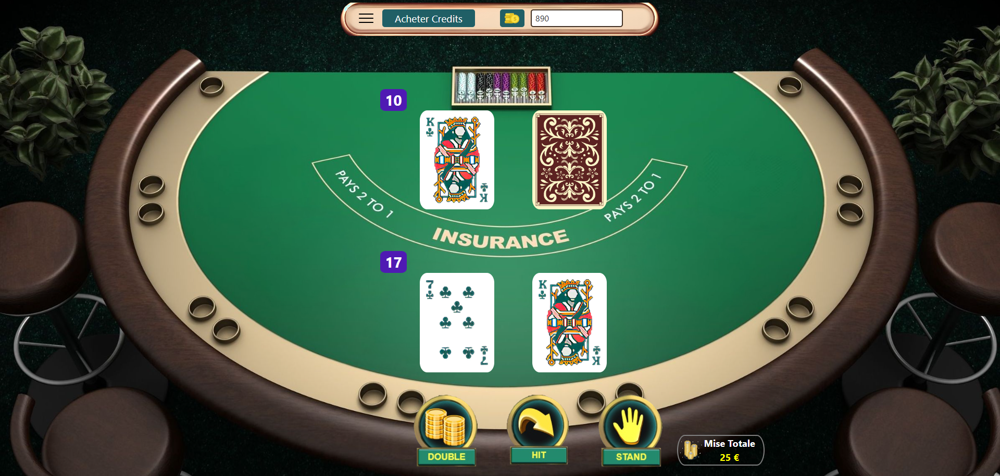
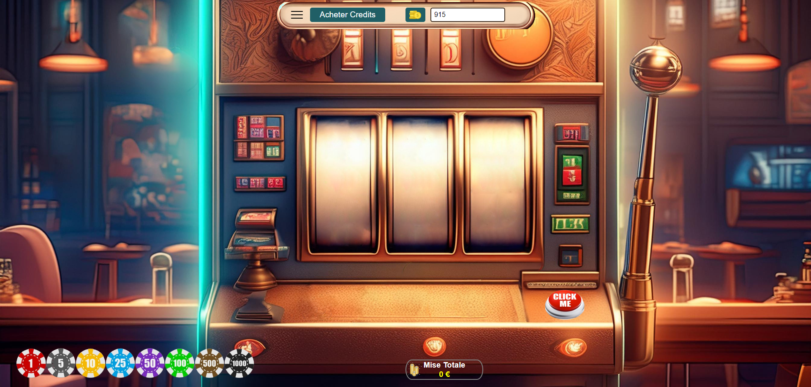
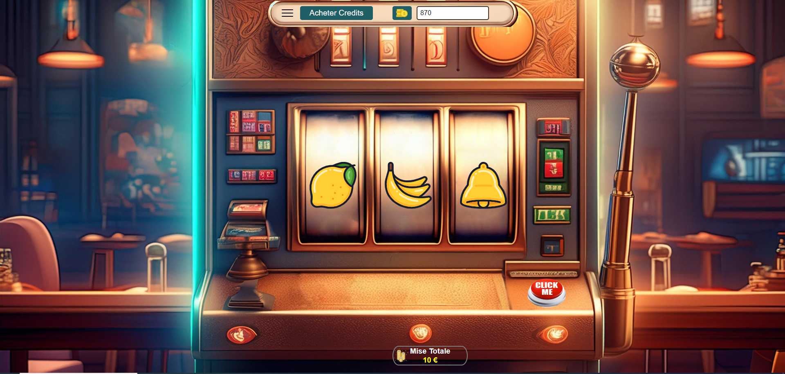
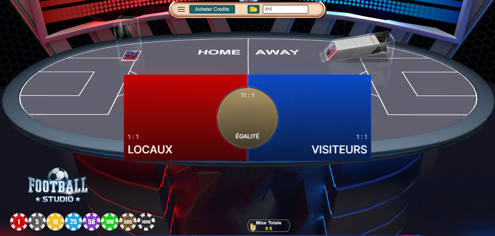
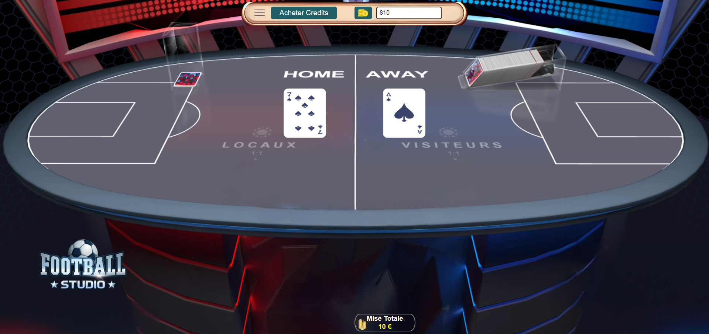
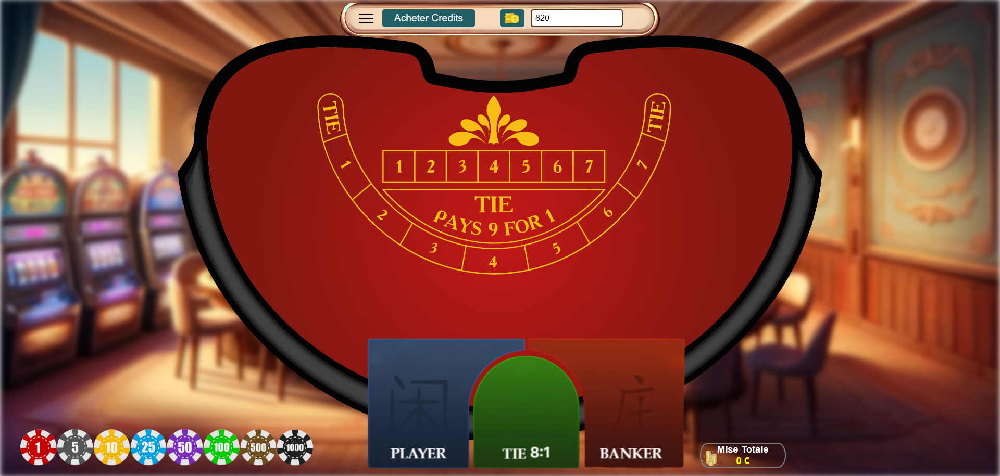
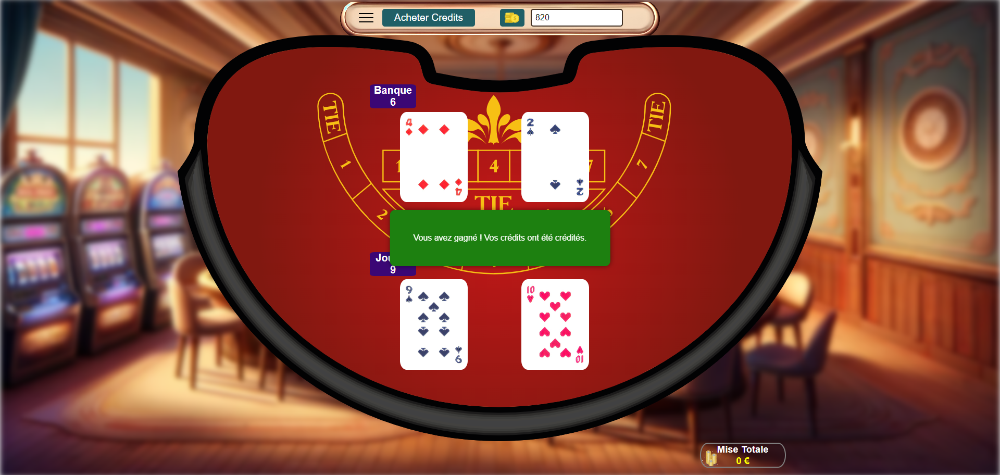

<h1 align="center">Présentation</h1>
Réalisation d'un Casino Virtuel en VueJS

<h2>Exemple d'interface :</h2>

<h3>Page d'Accueil</h3>

  

 
<h3> La Roulette</h3>

  

 
<h3>Le Blackjack</h3>

  

 
<h3>Le Blackjack (en phase de jeu)</h3>

  

 
<h3>La Machine à sous</h3>

  

 
<h3>La Machine à sous (en phase de jeu)</h3>

  

 
<h3>Football Studio</h3>

  

 
<h3>Football Studio (en phase de jeu)</h3>

  

 
<h3>Baccarat</h3>

  

 
<h3>Baccarat (en phase de jeu)</h3>

  

 
<h3>Animation de Victoire</h3>

  

